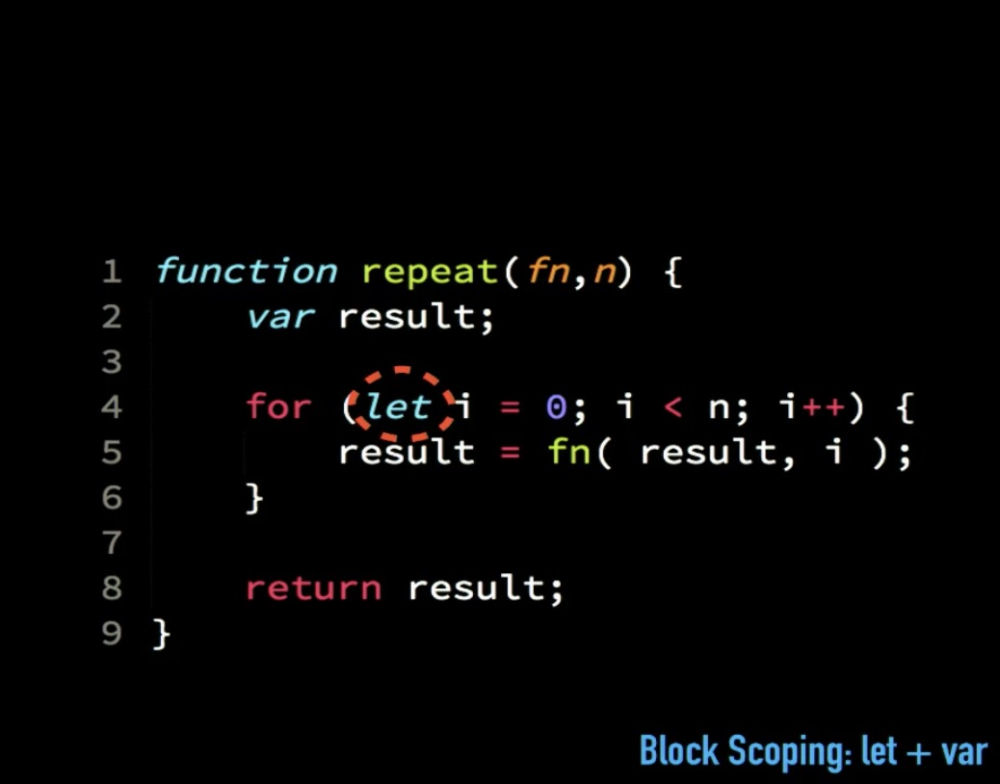

# Choosing _let_ or _var_

"let is the new var" is a wrong statement.
Instead "let + var".
Both useful in different context.

We use _let_ in line 4 and _var_ in line 2.

_let_ will work in line 2 but will remove a bit of syntactical info because it won’t know to use it only there or in the entire function. Since -result- is being used multiple times and also within functions within functions in the same way, it should use var.

_let_ signals very localised function and hence not right to use in line 2 with result. It is not the right tool for that particular context.
_var_ is more appropriate for it.

_let_ cannot be re-declared.
_const_ can’t be left uninitialised, has to be initialised when declaring.

