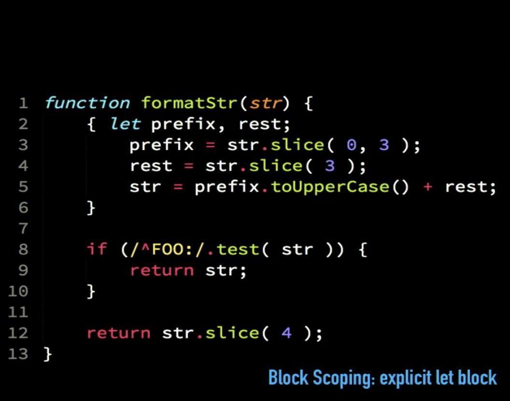

# Explicit let block

More localised. 

Used for variables used only for a little purpose.

Hardly any performance difference.
But narrows scope hence helpful.

Use _let_ as soon as open curly braces to describe couple of variables.

