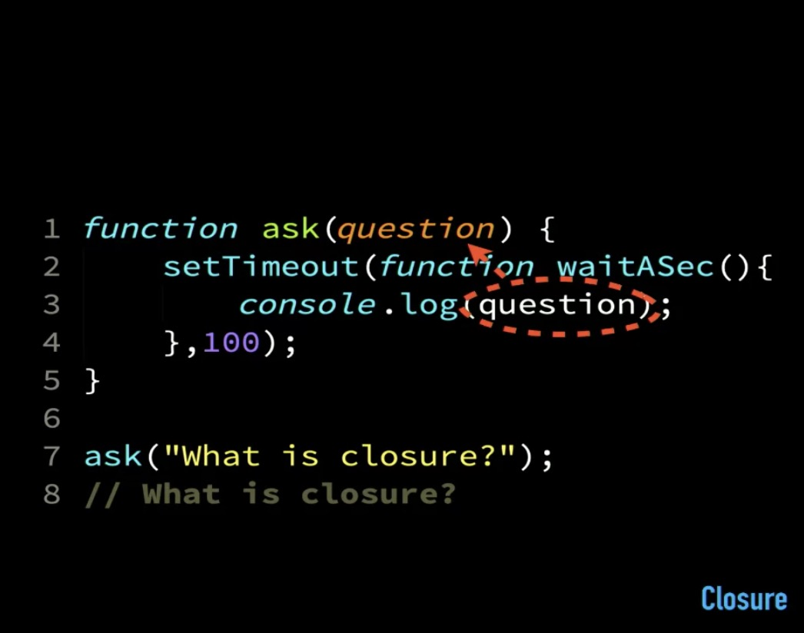

# What is Closure?

Closure can be defined as
> When a function “remembers” it’s lexical scope even when the function is executed outside that lexical scope (or a different scope).

It works even when a scope in which it was originally defined in is conceptually gone away, if the function survived that was within that scope, didn’t go away, it is able to _hold the reference to that scope and continues to have access_.

### Preservation of scope : 
Closure is the linkage back to the original scope when it was defined (no matter when it is executed, it retains the value).
Closure doesn’t capture values, it preserves access to the variables.
JS implements closure as linkage to the _entire_ scope, not per variable basis. 

Closure is a _scope-based function_ because **it works per scope, not per variable.**



# Closing over variables

Closure doesn’t mean “Snapshotting a value” or “Capturing a value” (common misconception)

It doesn’t close over values, it **closes over variables.**
Which means:
- It creates linkage to variable (not the value).
- It checks the value of variable at that moment

It rather ***Preserves access to variables***.


# Closure inside loops

```javascript

for (var i = 1; i <= 3; i++) {
  setTimeout(function() {
    console.log(`i: ${i}`);
  }, i * 0);
}
// i: 4
// i: 4
// i: 4
```

The reason the result gives 4,4,4 instead of 1,2,3 is because _i_ is only one variable, and as we studied earlier, _closure preserves access to variables (not value)_, so it preserves the value of the last instance of i.e. 4.

To recieve 3 different values, we needed 3 different variables, which can be achieved by using a **block scoped declaration** _(Solution using Scope)_

```javascript
for (var i = 1; i <= 3; i++) {
  let j = i;
  setTimeout(function() {
    console.log(`j: ${j}`);
  }, j * 0);
}
// j: 1
// j: 2
// j: 3
```

It preserves separate values of _j_ in each iteration. _j_ runs every time as the loop iterates
_New j is created in every iteration_

Or we can implement the above code as : 

```javascript
for (let i = 1; i <= 3; i++) {
  setTimeout(function() {
    console.log(`i: ${i}`);
  }, i * 0);
}
// i: 1
// i: 2
// i: 3
```

In the above code the _let_ statement is actually executing inside the loop even though its written with the for statement. Happens with for, for in, for of, etc.

Another approach to solve the problem without using _let_ or _const_ is by using IIFE

```javascript
for(var i=1;i<=3;i++) {
  (function(i){
    setTimeout(function(){
    console.log(i);
  },0);
  })(i);
}
// 1
// 2
// 3
```
#### Note :
Use of const will give an error as it is trying to modify the variable in i++.
