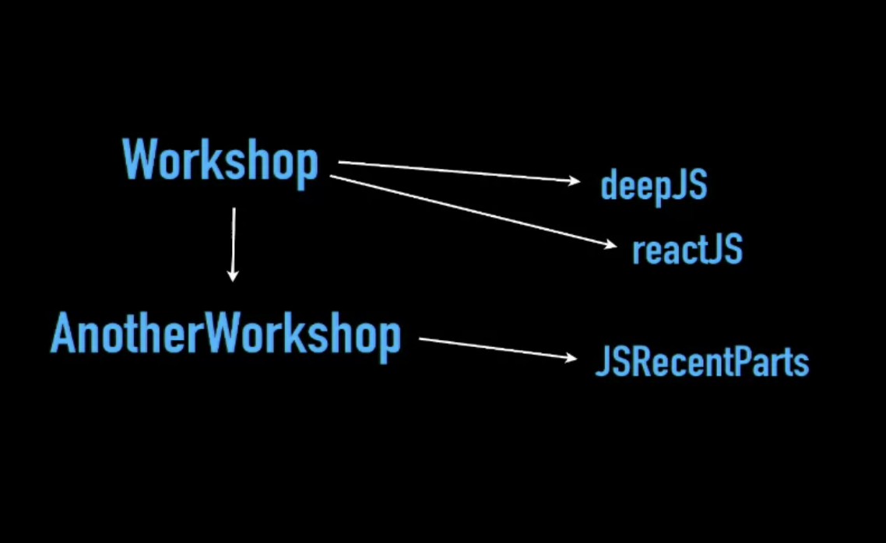
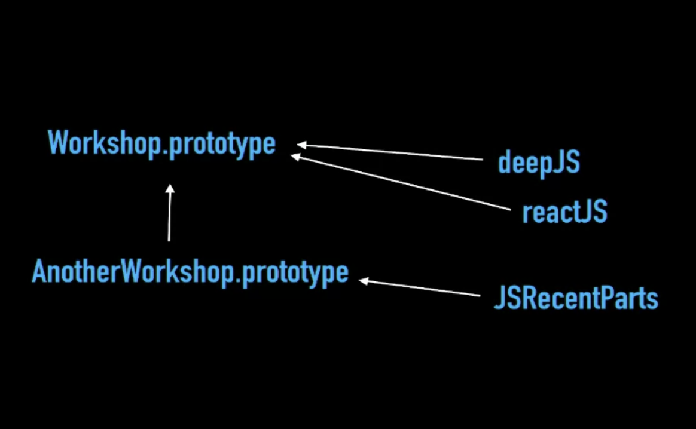

# Prototypal Inheritance

```javascript
function workshop(teacher) {
  this.teacher = teacher;
}

workshop.prototype.ask = function(question) {
  console.log(this.teacher, question);
};

function anotherworkshop(teacher){
  workshop.call(this,teacher);
}

anotherworkshop.prototype = Object.create(workshop.prototype);

anotherworkshop.prototype.speakup = function(msg){
  this.ask(msg.toUpperCase());
}

var ins1 = new anotherworkshop("kyle");

ins1.speakup("is this inheritance");
// kyle IS THIS INHERITANCE
```

- In the above code we create 2 prototypes and **link** the second prototype (anotherworkshop) to the first prototype (workshop)
using ```Object.create(workshop.prototype)```
- **ins1** is linked to **anotherworkshop** linked to **workshop** via a hidden prototype chain.
- When we invoke ```ins1.speakup```---> it goes to **anotherworkshop** and checks for _speakup_, which exists and invokes ```this.ask``` ---> it checks the call-site, there is no _ask_ in **ins1** ---> check one level up, no _ask_ in **anotherworkshop** ---> checks one level up, ask exists in **workshop** so invokes _workshop.ask_.

### Classical vs. Prototypal Inheritance

##### Classical Inheritance :
- The properties of classes are _copied_ from class to instance. Similarly, properties of parent class are _copied_ to child class.
- Arrows move from **left-to-right** and **top-to-bottom** because they're **fundamentally copy operations**



##### Prototypal Inheritance :
- The properties of prototypes are _linked_ from prototype object to instance object. Similarly, properties of  different prototypes are _linked_ to from second protobject to first protobject.
- Arrows move from **right-to-left** and **bottom-to-top** because they're **linkages**



- There is NO copy operation in prototypes, only linkages.
- Both are different design patterns and behave differently.

# Prototypal Inheritance is a Delegation

- JS' _Prototype System_ is a **Delegation System**, NOT a **Class System**.
- **Delegation** basically is the system of linkages instead of copy operations.
- Prototypal System is basically more powerful than Class System.
- Class System is a **subset** of Prototypal System because we can implement Class System inside Prototypal System, but we can't do the reverse.


