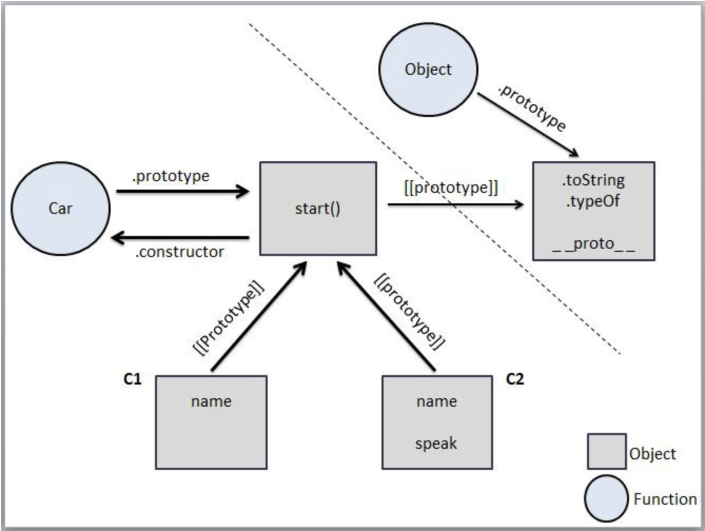

# Prototypal Class

```javascript
function workshop(teacher) {
  this.teacher = teacher;
}

//ask-property
workshop.prototype.ask = function(question) {
  console.log(this.teacher, question);
};

var ins1 = new workshop("kyle");
var ins2 = new workshop("suzy");

ins1.ask("is this prototype?");
ins2.ask("is this prototype?");

// kyle is this prototype? 
// suzy is this prototype?
```
- Objects are built by _"constructor calls"_ (via the _new_ keyword).
- When we use _new_ in front of a function call, it's constructing an object to be used for this binding of that function call.
- It is said that the "constructor calls" are making the objects ~based on~ the constructor’s prototype.
- The term "based on" above is not technicalluy true because JS doesn't make a copy of prototype when an object is created (like in other object oriented languages), It makes it linked to the prototype. So the correct way to say it would be :
- "Constructor calls" are making the objects _linked to_ the constructor’s prototype.

# The Prototype Chain



```javascript
function workshop(teacher) {
  this.teacher = teacher;
}

workshop.prototype.ask = function(question) {
  console.log(this.teacher, question);
};

var ins1 = new workshop("kyle");

console.log(ins1.constructor === workshop); //true
console.log(ins1.__proto__ === workshop.prototype); //true
console.log(Object.getPrototypeOf(ins1) === workshop.prototype); //true

console.log(ins1.__proto__); // Object {ask: function ()}
console.log(workshop.prototype.__proto__); // null
console.log(Object.prototype); // null
console.log(workshop.prototype.__proto__ === Object.prototype); //true
```
How does the Prototype Chain work:

```ins1.constructor === workshop // true```
- First, it checks for _constructor_ in **ins1**, doesn't exist.
- Then it looks up to the object linked to it i.e. **workshop.prototype**, it does have a _constructor property_ which points to **workshop**, hence it gives _true_.
- From the statement it seems like **ins1** was constructed by **workshop**, but we know that it was constructed by the _new_ keyword, sowhy :
- Basically these properties and relationships are in place to tell this narrative that a **class system** has occured.

## Dunder Prototypes
- The \_\_proto\_\_ property is a simple accessor property on Object.prototype consisting of a getter and setter function.
- It can _set_ the object [[Prototype]] on creation, as an alternative to Object.create(). 
- The \_\_proto\_\_ setter allows the [[Prototype]] of an object to be mutated.

```ins1.__proto__```
- The \_\_proto\_\_ getter function exposes the value of the internal [[Prototype]] of an object. 
- In the above code, **ins1** doesn't have the property, so it goes up to **workshop.prototype** which still doesn't have the property.
- Next it goes up to **Object.prototype**, it does have **\_\_proto\_\_** but it's NOT  a property, it's a **_getter function_**.
- Even though it's not a property, since it's a function, when it is invoked inside **Object.prototype**, it's _this_ keyword will be pointing to **ins1** (call-site, _this_-binding rule), and invokes **\_\_proto\_\_** in the context of the instance.


